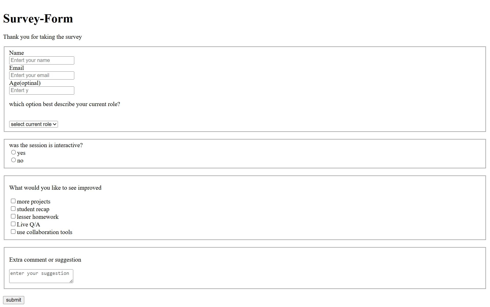

# survey form
## Overview

A simple HTML-based survey form for collecting user feedback.

Designed with clear labels, structured fieldsets, and input controls.

Focused on clean layout and user-friendly interaction.

## Features

Collects Name, Email, and Age (optional).

Dropdown menu to select current role.

Radio buttons to answer if the session was interactive.

Checkboxes for multiple improvement suggestions:

More projects

Student recap

Lesser homework

Live Q/A

Collaboration tools

## Technologies Used

HTML5

Basic form elements and attributes (input, select, checkbox, radio).

## Purpose

To collect survey data efficiently from participants.

To practice form creation and structuring in HTML.

Can be enhanced with CSS for styling and JavaScript for validation.

## Future Enhancements

Add form validation using JavaScript.

Store data using local storage or backend integration.

Make design responsive using CSS or frameworks like Bootstrap.
